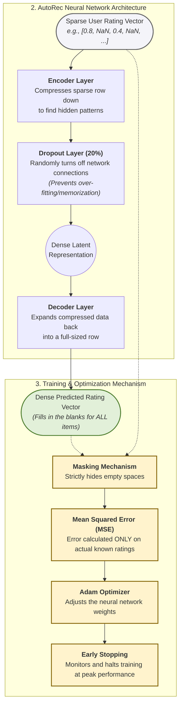

# AutoRec Architecture Flowchart

Here is the visual flow chart representing the Autoencoder-based Collaborative Filtering architecture (AutoRec) described in your methodology draft:

```mermaid
graph TD
    %% Styling Definitions
    classDef input fill:#f4f4f9,stroke:#666,stroke-width:2px;
    classDef output fill:#e2f0d9,stroke:#548235,stroke-width:2px;
    classDef training fill:#fff3cd,stroke:#856404,stroke-width:2px;

    %% Base Input
    Input(["Sparse User Rating Vector<br/><i>e.g., [0.8, NaN, 0.4, NaN, ...]</i>"])
    class Input input;

    %% Autoencoder Architecture
    subgraph AutoRec ["2. AutoRec Neural Network Architecture"]
        
        Input --> Encoder["<b>Encoder Layer</b><br/>Compresses sparse row down<br/>to find hidden patterns"]
        
        Encoder --> Dropout["<b>Dropout Layer (20%)</b><br/>Randomly turns off network connections<br/><i>(Prevents over-fitting/memorization)</i>"]
        
        Dropout --> Latent(("Dense Latent<br/>Representation"))
        
        Latent --> Decoder["<b>Decoder Layer</b><br/>Expands compressed data back<br/>into a full-sized row"]
    end

    %% Base Output
    Decoder --> Output(["Dense Predicted Rating Vector<br/><i>(Fills in the blanks for ALL items)</i>"])
    class Output output;

    %% Training and Optimization 
    subgraph Optimization ["3. Training & Optimization Mechanism"]
        Output -.-> Mask["<b>Masking Mechanism</b><br/>Strictly hides empty spaces"]
        Input -.-> Mask
        
        Mask --> MSE["<b>Mean Squared Error (MSE)</b><br/>Error calculated ONLY on actual known ratings"]
        
        MSE --> Adam["<b>Adam Optimizer</b><br/>Adjusts the neural network weights"]
        Adam --> EarlyStop["<b>Early Stopping</b><br/>Monitors and halts training at peak performance"]
    end
    
    class Mask,MSE,Adam,EarlyStop training;
```
